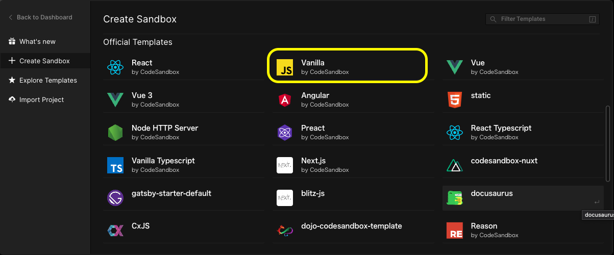
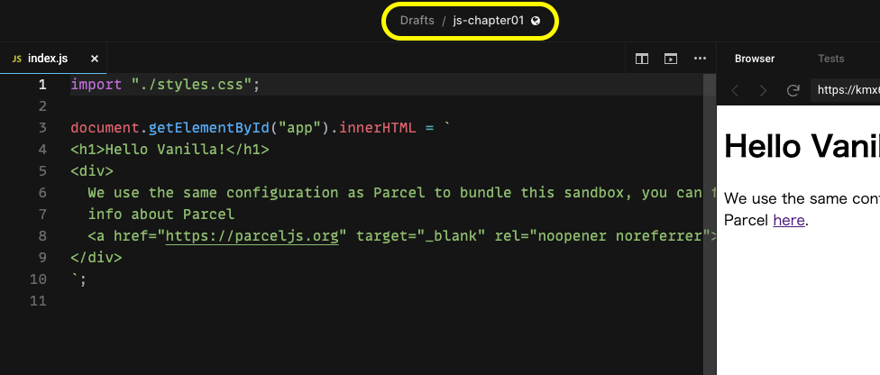

## セットアップ

ここで作る開発サイクルは以下のようになります。

1. *GitHub*にリポジトリを作成してソースコード管理する
2. コード記述は*CodeSandbox*上で行う
3. *CodeSandbox*上で記述したコードは、*GitHub*リポジトリに*Pull Request*する
4. *GitHub*上でマージする
5. 2〜4 の繰り返し

手順は[*CodeSandbox*ガイド](https://csb-jp.github.io/docs/github)に書いてある通りです。

<!--truncate-->

:::tip
上記サイトも[Docusaurus](https://docusaurus.io/)で出来ていることに気付いた方、、優秀です w
:::

### 事前チェック

1. [*CodeSandbox*](https://codesandbox.io/)を開いて、[このリポジトリ](https://github.com/a2-tsuchiya/js-plyaground)をフォークしてみましょう。
2. インポートしたリポジトリをエクスポートしてみましょう。
3. 自分のGitHub上にリポジトリができていればOKです。

:::caution
これができないと話にならないので必ず事前に確認してください。
:::

### 補足

テンプレートは*Vannila*を選択する（純粋な*JavaScript*）

*Drafts*を分かりやすい名前に変更する

